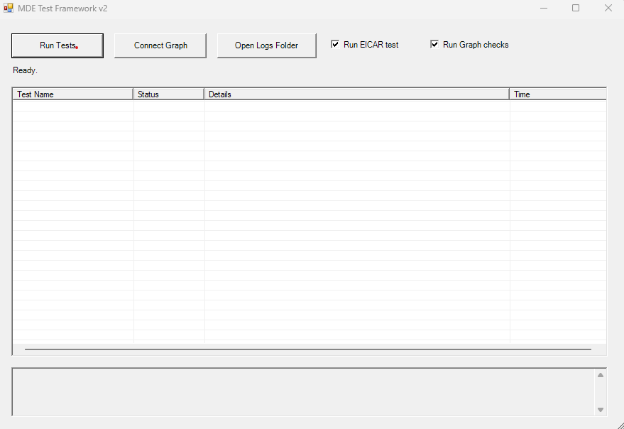
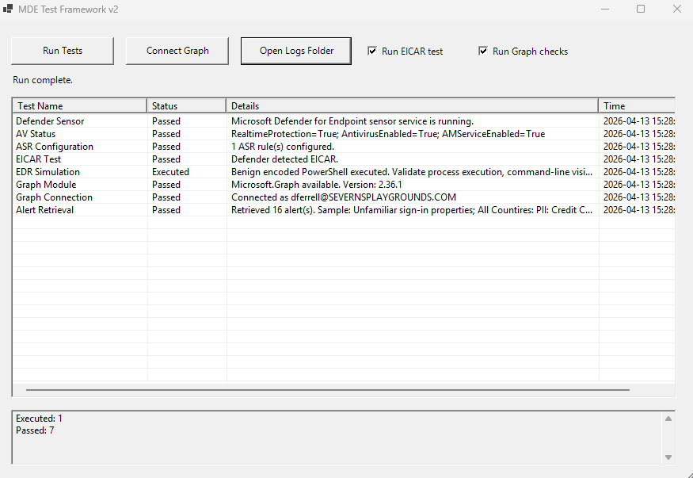
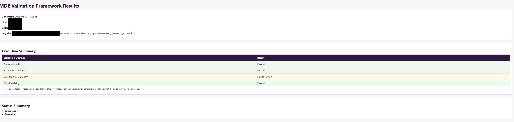

# 🛡️ Microsoft Defender for Endpoint Validation Framework


---

## 🛡️ The Problem

Defender can show as fully healthy.

That does not mean it’s working.

This framework helps you prove it.

## ✅ What This Framework Does

This framework allows you to safely simulate activity and validate how Defender actually behaves on an endpoint. Designed to be simple to run with minimal setup.

---

## ⚠️ If Results Don’t Match Expectations

Results may vary depending on:

- Defender mode (active vs passive)
- Onboarding state
- Licensing level
- Telemetry delays

Always validate device configuration before assuming failure.

## 🛡️ The Problem

Defender can appear fully onboarded and healthy.

But that does not guarantee detection and response are working as expected.

This framework helps validate that behavior in a controlled, safe way.

---

## 🎯 Who This Framework Is For

- Security engineers validating Defender deployments
- Administrators onboarding Microsoft Defender for Endpoint
- Teams testing security controls in lab or production environments

---

## 📑 Table of Contents

- OverviewWhat
- This Framework Validates
- Architecture
- Features
- Quick Start
- Test Categories
- Expected Outcomes & Verification
- Reporting
- Repository Structure
- Roadmap
- Requirements
- Disclaimers

# 📘 Overview

Deploying Microsoft Defender for Endpoint is only part of the solution.

This framework helps answer a more important question:

Are your endpoint security controls actually working as expected?

This project provides a structured approach to validating:

- Endpoint protection readiness
- Prevention controls (AV / ASR)
- Detection and telemetry generation
- Alert visibility through Microsoft Graph
- Analyst verification workflows

# 🎯 What This Framework Validates

This is not a vulnerability scanner or offensive tool.

It is a defensive validation framework designed to safely test:

✔️ Defender AV detection capability (EICAR)
✔️ Endpoint Detection & Response (EDR) telemetry
✔️ Attack Surface Reduction (ASR) configuration
✔️ Microsoft Graph alert visibility
✔️ Endpoint sensor and platform health
🏗️ Architecture

The framework is organized into validation domains:

- Platform Health
- Defender sensor (Sense service)
- AV status and readiness
- Prevention Validation
- Antivirus detection testing
- ASR configuration checks
- Detection & Telemetry
- Benign EDR simulation (encoded PowerShell)
- Timeline artifact generation
- Cloud Visibility
- Microsoft Graph connectivity
- Alert retrieval and inspection
- Reporting
- JSON output for automation
- HTML report for analysis and demonstration
  
# ⚙️ Features

- GUI-based execution (Invoke-MDEGui.ps1)
- Modular PowerShell framework (MDETestFramework.psm1)
- Safe AV validation using EICAR test string
- Benign EDR simulation for telemetry validation
- Microsoft Graph integration for alert retrieval
- JSON + HTML reporting outputs
- Designed for lab and enterprise validation scenarios

---

## 📸 Example Output

### GUI




### Validation Report




---
  
## 🚀 Quick Start

⚠️ Run PowerShell as Administrator for best results.

1. Clone the repository:

```powershell
git clone https://github.com/dferrell30/MDE-Test-Framework.git
cd MDE-Test-Framework
```
#Bypass if needed

 ```Powershell
 Set-ExecutionPolicy Bypass -Scope CurrentUser
```

#Powershell once at root

```PowerShell
.\Invoke-MDEGui.ps1
```

---

2. Run validation tests
- Select desired test options
- Connect to Microsoft Graph (optional)
- Execute tests
- Review results in HTML or JSON output
  
## 🧪 Test Categories

> 🧪 Tested in a lab environment. Results may vary based on Defender configuration, onboarding state, and licensing.

- Platform Health
- Validates Defender sensor and service status
- Confirms AV readiness and configuration
- Prevention Validation
- Executes EICAR test for AV detection validation
- Verifies ASR rule configuration presence
- Detection & Telemetry
- Executes benign encoded PowerShell
- Generates telemetry for timeline and hunting validation\
- Cloud Visibility
- Tests Microsoft Graph connectivity
- Retrieves recent Defender alerts

---

## 🔍 Expected Outcomes

| Test | Expected Result | Where to Validate | Why It Matters |
|------|---------------|------------------|----------------|
| EICAR Test | File detected or quarantined | Device timeline / alerts | Confirms AV detection is working |
| PowerShell Simulation | Process execution logged | Device timeline | Validates EDR telemetry visibility |
| Alert Retrieval | Alerts returned via Graph | MDE Portal / API | Ensures alerts are generated and accessible |
| ASR Checks | Rules enforced or reported | Defender settings / logs | Verifies attack surface reduction coverage |

Note: Some detections depend on policy configuration, sensitivity levels, and environment tuning.

---

📊 Reporting

The framework generates:

- JSON Output
- Structured results for automation
- Suitable for pipelines or further analysis
- HTML Report
- Human-readable validation report
- Useful for demos, audits, and validation evidence

## Example Output of HTML File


# 📁 Repository Structure
MDE-Test-Framework/
├── README.md
├── CHANGELOG.md
├── LICENSE
├── .gitignore
├── SECURITY.md
├── Invoke-MDEGui.ps1
├── MDETestFramework.psm1
├── docs/
│   └── PLAYBOOK.md
└── logs/
    └── .gitkeep

# 🛣️ Roadmap
 
 - ASR behavioral validation tests
 - Expected vs actual result mapping
 - Enhanced HTML reporting (analyst guidance)
 - Alert-to-test correlation
 - Advanced Hunting (KQL) integration
 - Expanded validation scenarios

# 🧰 Requirements

- Windows endpoint with Microsoft Defender for Endpoint onboarded
- PowerShell 5.1+ or PowerShell 7+
- Microsoft Graph PowerShell SDK (for cloud validation)
- Appropriate permissions for Graph queries
  
# ⚠️ Disclaimers

This project is intended for defensive security validation and educational use.

Do not use this framework in unauthorized environments
Do not use for offensive or malicious purposes
Always perform testing in approved lab or enterprise environments
Some tests generate telemetry that may trigger alerts

The author is not responsible for misuse of this tool or unintended impacts resulting from its execution.

This tool is provided for **educational, testing, and security validation purposes only**.

Use of this tool should be limited to:
- Authorized environments  
- Lab or approved enterprise systems  

The author assumes **no liability or responsibility** for:
- Misuse of this tool  
- Damage to systems  
- Unauthorized or improper use  

By using this tool, you agree to use it in a lawful and responsible manner.

---

This project is not affiliated with or endorsed by Microsoft.

---

## ⚖️ Professional Disclaimer

This project is an independent work developed in a personal capacity.

The views, opinions, code, and content expressed in this repository are solely my own and do not reflect the views, policies, or positions of any current or future employer, client, or affiliated organization.

No employer, past, present, or future, has reviewed, approved, endorsed, or is in any way associated with these works.

This project was developed outside the scope of any employment and without the use of proprietary, confidential, or restricted resources.

All code/language in this repository is provided under the terms of the included MIT License.
