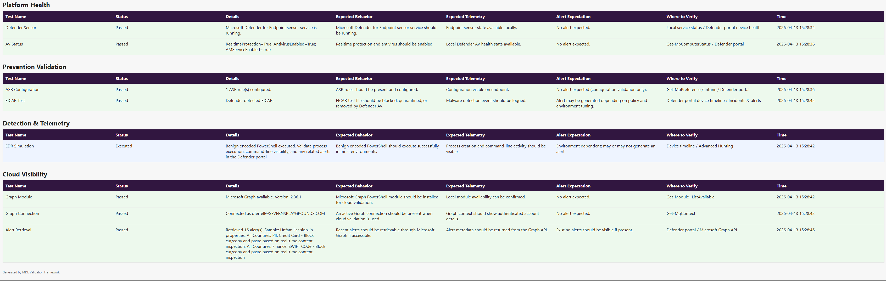

# 🛡️ Microsoft Defender for Endpoint Validation Framework

A PowerShell-based framework for validating the effectiveness, visibility, and behavior of Microsoft Defender for Endpoint (MDE) controls through safe, controlled simulations.

# 🔍 “What could cause different results”
	•	passive mode
	•	no alerts generated
	•	EICAR not triggering
	•	delayed telemetry

## 📑 Table of Contents

- OverviewWhat
- This Framework Validates
- Architecture
- Features
- Quick Start
- Test Categories
- Expected Outcomes & Verification
- Reporting
- Repository Structure
- Roadmap
- Requirements
- Disclaimers

# 📘 Overview

Deploying Microsoft Defender for Endpoint is only part of the solution.

This framework helps answer a more important question:

Are your endpoint security controls actually working as expected?

This project provides a structured approach to validating:

- Endpoint protection readiness
- Prevention controls (AV / ASR)
- Detection and telemetry generation
- Alert visibility through Microsoft Graph
- Analyst verification workflows

# 🎯 What This Framework Validates

This is not a vulnerability scanner or offensive tool.

It is a defensive validation framework designed to safely test:

✔️ Defender AV detection capability (EICAR)
✔️ Endpoint Detection & Response (EDR) telemetry
✔️ Attack Surface Reduction (ASR) configuration
✔️ Microsoft Graph alert visibility
✔️ Endpoint sensor and platform health
🏗️ Architecture

The framework is organized into validation domains:

- Platform Health
- Defender sensor (Sense service)
- AV status and readiness
- Prevention Validation
- Antivirus detection testing
- ASR configuration checks
- Detection & Telemetry
- Benign EDR simulation (encoded PowerShell)
- Timeline artifact generation
- Cloud Visibility
- Microsoft Graph connectivity
- Alert retrieval and inspection
- Reporting
- JSON output for automation
- HTML report for analysis and demonstration
  
# ⚙️ Features

- GUI-based execution (Invoke-MDEGui.ps1)
- Modular PowerShell framework (MDETestFramework.psm1)
- Safe AV validation using EICAR test string
- Benign EDR simulation for telemetry validation
- Microsoft Graph integration for alert retrieval
- JSON + HTML reporting outputs
- Designed for lab and enterprise validation scenarios

---

## 📸 Example Output

### GUI Interface

---

### Validation Report

---
  
# 🚀 Quick Start

1. Clone the repository
git clone https://github.com/<your-username>/MDE-Test-Framework.git
cd MDE-Test-Framework

3. Launch the GUI
powershell -ExecutionPolicy Bypass -File .\Invoke-MDEGui.ps1

5. Run validation tests
- Select desired test options
- Connect to Microsoft Graph (optional)
- Execute tests
- Review results in HTML or JSON output
  
## 🧪 Test Categories

- Platform Health
- Validates Defender sensor and service status
- Confirms AV readiness and configuration
- Prevention Validation
- Executes EICAR test for AV detection validation
- Verifies ASR rule configuration presence
- Detection & Telemetry
- Executes benign encoded PowerShell
- Generates telemetry for timeline and hunting validation\
- Cloud Visibility
- Tests Microsoft Graph connectivity
- Retrieves recent Defender alerts
  
# 🔍 Expected Outcomes & Verification

| Test | Expected Behavior | Detection / Telemetry | Alert Expectation | Where to Verify |
|------|------------------|----------------------|------------------|----------------|
| EICAR | File is blocked or quarantined by Defender AV | Malware detection event logged | Alert may be generated depending on policy | Defender portal → Device timeline / Incidents |
| EDR Simulation | Encoded PowerShell executes successfully (not blocked in most cases) | Process creation and command-line activity recorded | Alert is environment-dependent (may not trigger) | Device timeline / Advanced Hunting |
| ASR Configuration | ASR rules are present and configured (Block/Audit/Warn) | Configuration visible on endpoint | No alert expected (configuration check only) | Endpoint configuration / Intune / Defender portal |
| Graph Alerts | Recent alerts retrieved successfully via API | Alert metadata returned from Graph | Existing alerts visible if present | Defender portal / Microsoft Graph API |

Note: Some detections depend on policy configuration, sensitivity levels, and environment tuning.

📊 Reporting

The framework generates:

- JSON Output
- Structured results for automation
- Suitable for pipelines or further analysis
- HTML Report
- Human-readable validation report
- Useful for demos, audits, and validation evidence

# 📁 Repository Structure
MDE-Test-Framework/
├── README.md
├── CHANGELOG.md
├── LICENSE
├── .gitignore
├── SECURITY.md
├── Invoke-MDEGui.ps1
├── MDETestFramework.psm1
├── docs/
│   └── PLAYBOOK.md
└── logs/
    └── .gitkeep

# 🛣️ Roadmap
 
 - ASR behavioral validation tests
 - Expected vs actual result mapping
 - Enhanced HTML reporting (analyst guidance)
 - Alert-to-test correlation
 - Advanced Hunting (KQL) integration
 - Expanded validation scenarios

# 🧰 Requirements

- Windows endpoint with Microsoft Defender for Endpoint onboarded
- PowerShell 5.1+ or PowerShell 7+
- Microsoft Graph PowerShell SDK (for cloud validation)
- Appropriate permissions for Graph queries
  
# ⚠️ Disclaimers

This project is intended for defensive security validation and educational use.

Do not use this framework in unauthorized environments
Do not use for offensive or malicious purposes
Always perform testing in approved lab or enterprise environments
Some tests generate telemetry that may trigger alerts

The author is not responsible for misuse of this tool or unintended impacts resulting from its execution.
